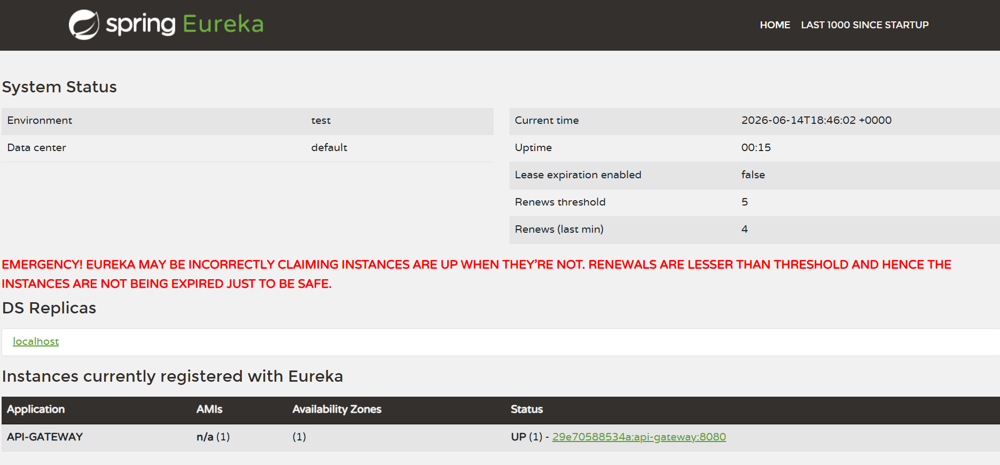
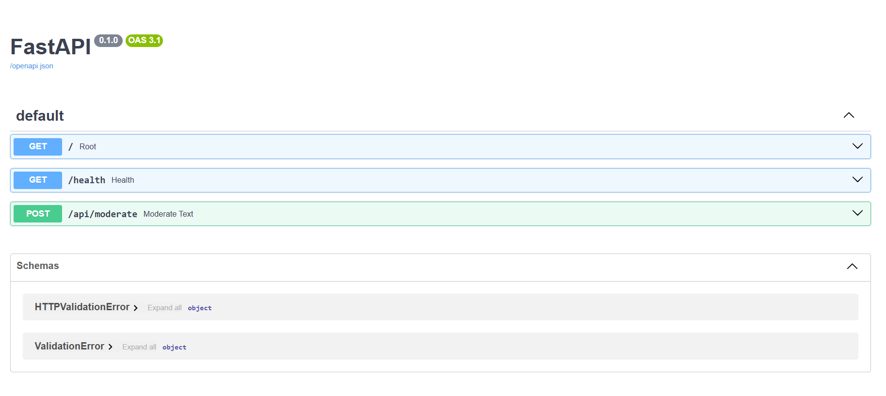
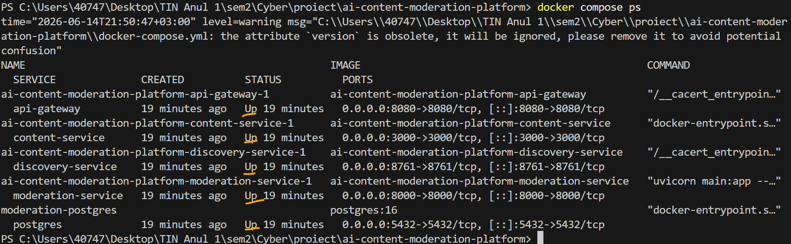

# AI-Powered Secure Content Moderation Platform

Cloud-native polyglot microservices platform for AI-powered text moderation.

---

# Overview

This project is a cloud-native distributed moderation platform built using a microservices architecture.
The system analyzes user-generated text content using AI moderation and stores moderation results in PostgreSQL.

The platform combines multiple technologies and programming languages:

* Java / Spring Boot
* NestJS / Node.js
* Python / FastAPI
* PostgreSQL
* Docker Compose

The system is designed with scalability, modularity, and cloud deployment in mind.

---

# Architecture

```text
Angular Frontend
        |
        v
API Gateway - Spring Cloud Gateway
        |
        v
Content Service - NestJS
        |
        v
Moderation Service - FastAPI
        |
        v
OpenAI API / Local Fallback
        |
        v
PostgreSQL
```

---

# Technologies

| Component          | Technology                  |
| ------------------ | --------------------------- |
| Discovery Service  | Spring Boot Eureka          |
| API Gateway        | Spring Cloud Gateway        |
| Content Service    | NestJS / Node.js            |
| Moderation Service | FastAPI / Python            |
| Database           | PostgreSQL                  |
| ORM                | Prisma                      |
| Frontend           | Angular                     |
| AI Moderation      | OpenAI API + Local Fallback |
| Containerization   | Docker                      |
| Orchestration      | Docker Compose              |

---

# Features

* Cloud-native microservices architecture
* API Gateway routing
* Eureka service discovery
* AI-powered text moderation
* Local fallback moderation system
* PostgreSQL persistence
* Dockerized infrastructure
* API versioning
* Swagger documentation
* Polyglot architecture

---

# Microservices

| Service                  | Port |
| ------------------------ | ---- |
| Eureka Discovery Service | 8761 |
| API Gateway              | 8080 |
| Content Service          | 3000 |
| Moderation Service       | 8000 |
| PostgreSQL               | 5432 |

---

# Project Structure

```text
ai-content-moderation-platform/
│
├── api-gateway/
├── content-service/
├── moderation-service/
├── discovery-service/
├── docker-compose.yml
├── README.md
└── architecture.md
```

---

# Docker Setup

## Run all services

```bash
docker compose up --build
```

## Stop all services

```bash
docker compose down
```

---

# Test URLs

## Eureka Dashboard

```text
http://localhost:8761
```

## API Gateway

```text
http://localhost:8080/api/v1/posts
```

## Content Service Direct Access

```text
http://localhost:3000/api/v1/posts
```

## Moderation Service Swagger

```text
http://localhost:8000/docs
```

---

# Example API Request

## Create post

```powershell
Invoke-RestMethod -Uri "http://localhost:8080/api/v1/posts" `
-Method POST `
-ContentType "application/json" `
-Body '{"text":"I hate everyone"}'
```

---

# Moderation Workflow

1. User sends content through API Gateway.
2. Gateway forwards request to Content Service.
3. Content Service sends text to Moderation Service.
4. Moderation Service analyzes content using:

   * OpenAI Moderation API
   * Local fallback moderation
5. Moderation result is returned.
6. Content Service stores the post and moderation result in PostgreSQL.
7. Response is returned to the client.

---

# Example Response

```json
{
  "id": 1,
  "text": "I hate everyone",
  "moderationStatus": "BLOCKED",
  "createdAt": "2026-05-28T09:00:00.000Z"
}
```

---

# Local Fallback Moderation

If the OpenAI API is unavailable or rate-limited, the system automatically switches to a local fallback moderation mechanism.

This ensures:

* High availability
* Fault tolerance
* Graceful degradation
* Stable demonstrations without external API dependency

---

# Future Improvements

* AWS ECS/Fargate deployment
* AWS RDS PostgreSQL
* AWS Cognito authentication
* AWS CodePipeline CI/CD
* Advanced RBAC authorization
* RabbitMQ event-driven architecture
* Observability and monitoring
* Distributed tracing
* Kubernetes deployment

---

## Screenshots

### Angular Dashboard


### Eureka Discovery



### FastAPI Swagger



### Docker Containers




# Demo Scenario

1. User creates a post using the Angular dashboard.
2. Request is sent through the API Gateway.
3. Content Service receives the request.
4. Moderation Service analyzes the content.
5. The moderation result is returned.
6. The post is stored in PostgreSQL.
7. The user sees the moderation result in the dashboard.


# Author
Lupu Elena
Master's Degree Project — Internet Technologies
Cloud-Native AI Moderation Platform
