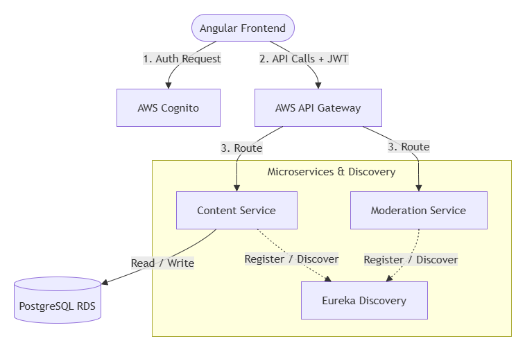
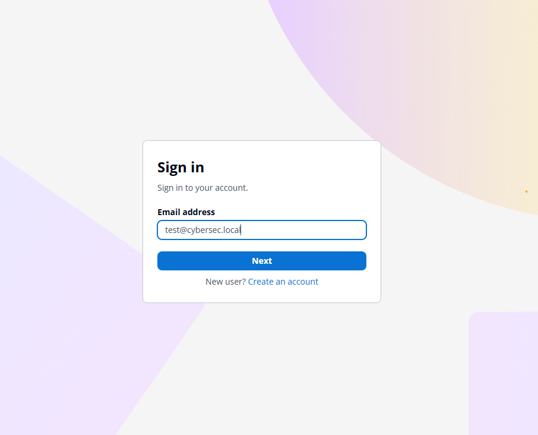
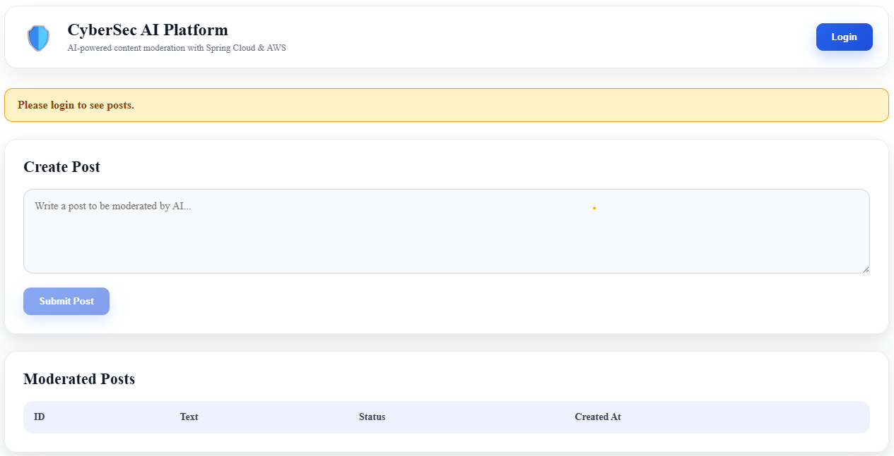
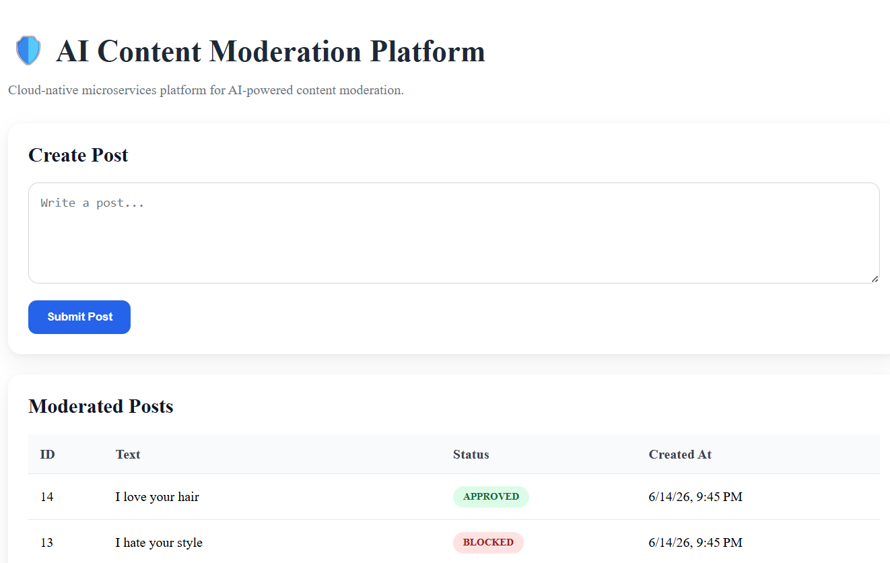
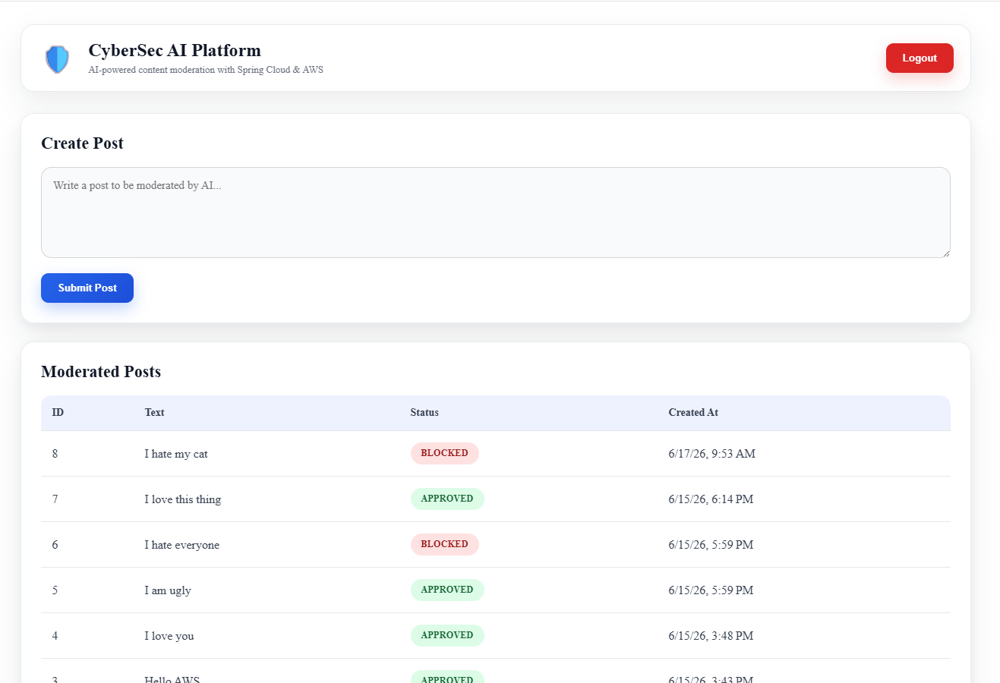
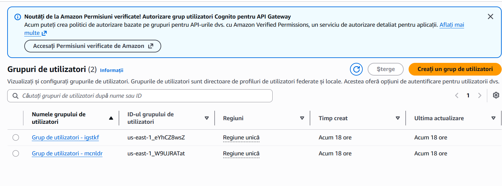
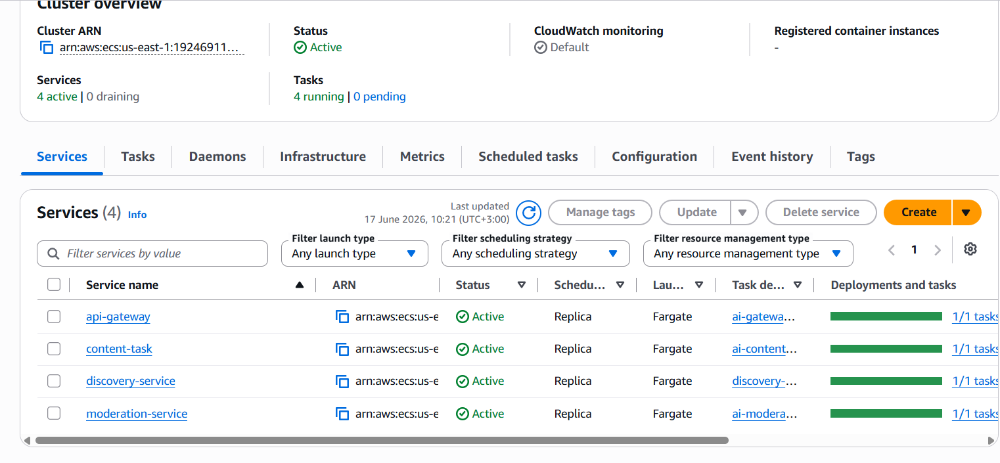
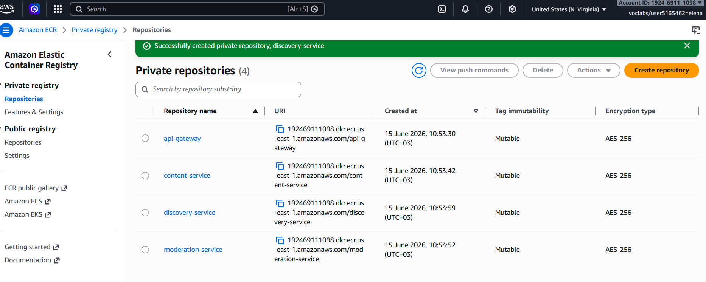

# AI Content Moderation Platform

Cloud-native microservices platform for AI-powered content moderation, built with Spring Cloud, AWS ECS, AWS Cognito, PostgreSQL RDS, Docker and Angular.

## 1. Project Overview

This project allows authenticated users to create posts. Each post is sent through an AI moderation flow and then stored in a PostgreSQL database.

The project was adapted to meet the course requirements:

* Spring Boot application with Spring Cloud dependencies
* Microservices architecture
* Eureka Discovery Server
* API Gateway
* PostgreSQL database
* Docker images
* AWS ECS deployment
* Spring Security
* External IAM using AWS Cognito
* AI-assisted content moderation
* AI tools used for code generation, validation, vulnerability review and documentation

## 2. Architecture
## 2.1 Architecture Diagram

The following diagram illustrates the complete system architecture and communication flow between the frontend, AWS Cognito, Spring Cloud components, microservices and database.



The frontend communicates exclusively with the API Gateway. Authentication is delegated to AWS Cognito, which issues JWT tokens. The API Gateway validates JWT tokens using Spring Security before forwarding requests to the internal microservices. The Content Service persists data in PostgreSQL RDS, while Eureka provides service registration and discovery.

```text
Angular Frontend
        |
        v
AWS Cognito
External IAM
        |
        v
Spring Cloud API Gateway
Spring Security + JWT
        |
   +----+----+
   |         |
   v         v
Content   Moderation
Service    Service
   |
   v
PostgreSQL RDS

Eureka Discovery Service
```

## 3. Services

| Service            | Technology                         | Port | Purpose                               |
| ------------------ | ---------------------------------- | ---: | ------------------------------------- |
| Frontend           | Angular                            | 4200 | User interface                        |
| API Gateway        | Spring Boot + Spring Cloud Gateway | 8080 | Single entry point, routing, security |
| Discovery Service  | Spring Boot + Eureka               | 8761 | Service discovery                     |
| Content Service    | NestJS / Node.js                   | 3000 | Post management                       |
| Moderation Service | FastAPI / Python                   | 8000 | AI moderation                         |
| Database           | PostgreSQL / AWS RDS               | 5432 | Persistent storage | 

## 3.1 Screenshots

### Login Page

Users authenticate through AWS Cognito before accessing protected resources.



### Unauthenticated View

When no JWT token is available, protected functionality is hidden and users are prompted to log in.



### Dashboard

After successful authentication, users can view moderated posts and create new content.



### Posts Loaded

Posts are retrieved through the secured API Gateway using JWT authentication.



### AWS Cognito User Pool

AWS Cognito is used as the external Identity and Access Management (IAM) solution required by the project specification.



### Eureka Discovery Service

All backend services register with Eureka for service discovery.


### Amazon ECS Services

Microservices are deployed and managed through Amazon ECS.



### Amazon ECR

Docker container images are stored in Amazon Elastic Container Registry.



### PostgreSQL Database (AWS RDS)

Persistent application data is stored in PostgreSQL hosted in Amazon RDS.


### Docker Images

Containerized services used for local development and AWS deployment.

                  

## 4. Authentication

Authentication is implemented with AWS Cognito.

Flow:

```text
User clicks Login
        |
        v
AWS Cognito Login Page
        |
        v
Authorization Code returned to Angular
        |
        v
Angular sends code to /auth/token
        |
        v
API Gateway exchanges code for JWT
        |
        v
Angular stores access_token
        |
        v
Requests are sent with Authorization: Bearer <token>
```

Protected endpoints:

```text
GET  /api/v1/posts
POST /api/v1/posts
POST /api/moderate
```

Public endpoint:

```text
POST /auth/token
```

## 5. Test User

For demo/testing:

```text
Username / Email: test@cybersec.local
Password: CyberSec123!
```

This user is created in AWS Cognito.

## 6. Run Locally

Start backend services:

```bash
docker compose up --build
```

Start frontend locally:

```bash
cd frontend
npm run start:local
```

or:

```bash
ng serve --proxy-config proxy.local.conf.json
```

Open:

```text
http://localhost:4200
```

Local test URLs:

```text
Eureka:
http://localhost:8761

Gateway protected posts endpoint:
http://localhost:8080/api/v1/posts

Moderation endpoint:
http://localhost:8080/api/moderate
```

Expected behavior:

* `http://localhost:8761` opens Eureka dashboard.
* `http://localhost:8080/api/v1/posts` returns `401 Unauthorized` without login.
* After login through Cognito, the Angular app displays the list of posts.
* Creating a post works only after authentication.

## 7. Run Frontend Against AWS Backend

Start frontend using AWS proxy:

```bash
cd frontend
npm run start:aws
```

or:

```bash
ng serve --proxy-config proxy.aws.conf.json
```

Open:

```text
http://localhost:4200
```

Current AWS Gateway URL used in proxy:

```text
http://<API_GATEWAY_PUBLIC_IP>:8080
```

AWS test URLs:

```text
API Gateway:
http://<API_GATEWAY_PUBLIC_IP>:8080/api/v1/posts

Auth token endpoint:
http://<API_GATEWAY_PUBLIC_IP>:8080/auth/token

Eureka:
http://<EUREKA_PUBLIC_IP>:8761
```

Expected behavior:

* `/api/v1/posts` returns `401 Unauthorized` without a JWT.
* `/auth/token` should not return `404`; with GET it may return `405 Method Not Allowed` because it expects POST.
* Login from the Angular UI redirects to Cognito.
* After login, posts are displayed.
* Submit Post creates a new post.
* Logout clears the session and redirects through Cognito logout.

## 8. Proxy Configuration

### Local proxy

`frontend/proxy.local.conf.json`

```json
{
  "/api": {
    "target": "http://localhost:8080",
    "secure": false,
    "changeOrigin": true
  },
  "/auth": {
    "target": "http://localhost:8080",
    "secure": false,
    "changeOrigin": true
  }
}
```

### AWS proxy

`frontend/proxy.aws.conf.json`

```json
{
  "/api": {
    "target": "http://<API_GATEWAY_PUBLIC_IP>:8080",
    "secure": false,
    "changeOrigin": true
  },
  "/auth": {
    "target": "http://<API_GATEWAY_PUBLIC_IP>:8080",
    "secure": false,
    "changeOrigin": true
  }
}
```

If the ECS task is redeployed, the public IP may change. In that case, update `proxy.aws.conf.json`.

## 9. Important AWS Environment Variables

The API Gateway uses environment variables instead of hardcoded service URLs.

Required ECS environment variables for `api-gateway`:

```text
EUREKA_URL=http://172.31.17.107:8761/eureka/
CONTENT_SERVICE_URL=http://172.31.6.226:3000
MODERATION_SERVICE_URL=http://172.31.27.12:8000
COGNITO_CLIENT_ID=64c81glsepuvt32pe836aaqeak
COGNITO_CLIENT_SECRET=<stored in ECS environment variables>
COGNITO_TOKEN_URI=https://us-east-1w9ujratat.auth.us-east-1.amazoncognito.com/oauth2/token
```

The client secret must not be committed to GitHub.

## 10. Build and Push API Gateway to AWS ECR

Build API Gateway image:

```bash
docker compose build api-gateway
```

Tag image:

```bash
docker tag ai-content-moderation-platform-api-gateway:latest 192469111098.dkr.ecr.us-east-1.amazonaws.com/api-gateway:latest
```

Login to ECR:

```bash
aws ecr get-login-password --region us-east-1 | docker login --username AWS --password-stdin 192469111098.dkr.ecr.us-east-1.amazonaws.com
```

Push image:

```bash
docker push 192469111098.dkr.ecr.us-east-1.amazonaws.com/api-gateway:latest
```

Then in AWS ECS:

```text
ECS → Cluster → api-gateway service → Force new deployment
```

After deployment, copy the new public IP and update `frontend/proxy.aws.conf.json`.

## 11. Git Commands

Check changes:

```bash
git status
```

Add all changes:

```bash
git add .
```

Commit:

```bash
git commit -m "Add Cognito authentication, AWS deployment config and documentation"
```

Push:

```bash
git push
```

## 12. AWS Security Notes

During development and testing, some security groups may allow public access using:

```text
0.0.0.0/0
```

For a production-ready setup, the recommended configuration is:

| Component          | Recommended Inbound Rule                           |
| ------------------ | -------------------------------------------------- |
| API Gateway        | Port 8080 from 0.0.0.0/0                           |
| Eureka             | Port 8761 only from developer IP or internal VPC   |
| Content Service    | Port 3000 only from API Gateway Security Group     |
| Moderation Service | Port 8000 only from API Gateway Security Group     |
| PostgreSQL RDS     | Port 5432 only from Content Service Security Group |

## 13. Demo Checklist

Before presentation, verify:

```text
1. Start frontend with npm run start:aws
2. Open http://localhost:4200
3. Click Login
4. Authenticate with Cognito
5. Verify post list appears
6. Submit a new post
7. Verify the post appears in the table
8. Click Logout
9. Verify the user is redirected/logout state is cleared
10. Open Eureka dashboard
11. Show ECS services running
12. Show Cognito User Pool
```

## 14. AI-Assisted Development

AI-assisted development practices were used throughout the project lifecycle for implementation, debugging, testing and documentation.

AI support was used for:

- Spring Security configuration
- AWS Cognito OAuth2 integration
- JWT validation troubleshooting
- Docker and AWS deployment troubleshooting
- ECS and ECR deployment validation
- Environment variable management
- Frontend authentication flow implementation
- Architecture documentation generation
- Security review and recommendations
- Presentation and project documentation preparation

All generated solutions were manually reviewed, tested and integrated into the final implementation.

## 15. Course Requirements Mapping

| Requirement | Status |
|------------|---------|
| Spring Boot Application | ✅ |
| Spring Cloud | ✅ |
| Eureka Discovery Service | ✅ |
| API Gateway | ✅ |
| Database | ✅ PostgreSQL RDS |
| Docker Images | ✅ |
| Docker Compose | ✅ |
| Spring Security | ✅ |
| External IAM | ✅ AWS Cognito |
| AWS Deployment | ✅ Amazon ECS |
| AI-based Content Moderation | ✅ |

## 16. Conclusion

The project demonstrates a secure microservices architecture using Spring Cloud, Eureka, API Gateway, AWS Cognito, PostgreSQL RDS, Docker and AWS ECS.

It implements authentication with an external IAM system, protects backend routes using JWT validation, and provides an AI-powered content moderation workflow.
