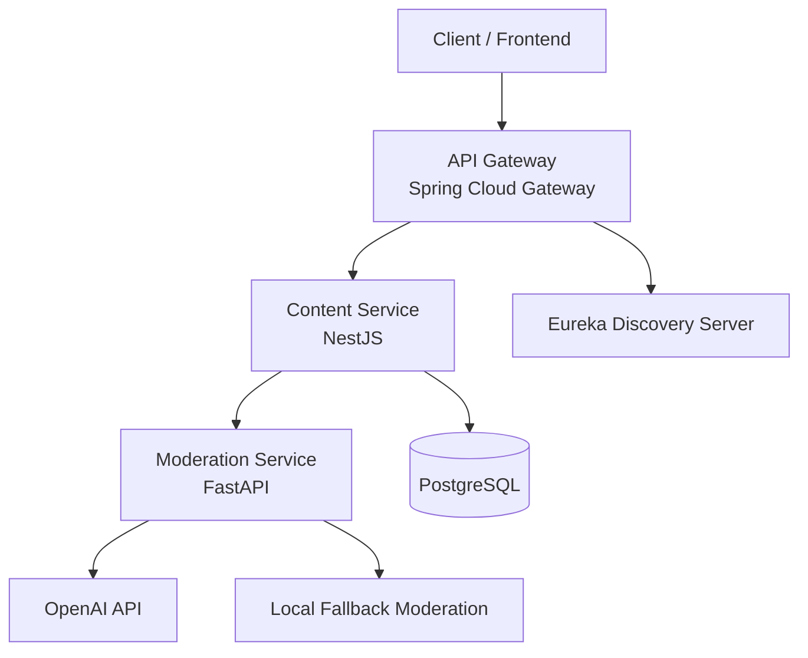
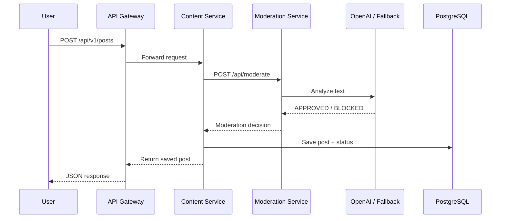

# Architecture Diagram

## High-Level Architecture

```mermaid
flowchart TD
    A[Client / Frontend] --> B[API Gateway<br/>Spring Cloud Gateway]
    B --> C[Content Service<br/>NestJS]
    C --> D[Moderation Service<br/>FastAPI]
    D --> E[OpenAI API]
    D --> F[Local Fallback Moderation]
    C --> G[(PostgreSQL)]
    B --> H[Eureka Discovery Server]
```

---

# Request Flow

```mermaid
sequenceDiagram
    participant User
    participant Gateway as API Gateway
    participant Content as Content Service
    participant Moderation as Moderation Service
    participant AI as OpenAI / Fallback
    participant DB as PostgreSQL

    User->>Gateway: POST /api/v1/posts
    Gateway->>Content: Forward request
    Content->>Moderation: POST /api/moderate
    Moderation->>AI: Analyze text
    AI-->>Moderation: APPROVED / BLOCKED
    Moderation-->>Content: Moderation decision
    Content->>DB: Save post + status
    Content-->>Gateway: Return saved post
    Gateway-->>User: JSON response
```
